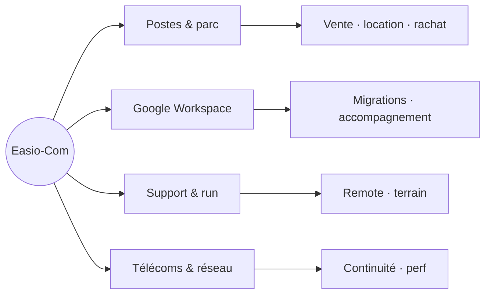

<pre align="center">
┌──────────────────────────────────────────┐
│                                          │
│              E A S I O · C O M           │
│        infra · postes · télécom · ops    │
│                                          │
└──────────────────────────────────────────┘
</pre>

  <strong>Opérer l’existant, déployer le nécessaire.</strong> 
  SAS · Languidic (56) · Bretagne

 

Nous sommes un **partenaire IT & télécoms** : un interlocuteur, des décisions lisibles, une exécution propre.  
Professionnels comme particuliers — du **choix du matériel** à l’**infogérance**, en passant par le **support** sur site ou à distance.

 

 

| | |
| :-- | :-- |
| **Postes** | Spec, installation, paramétrage, mise en service |
| **Collaboration** | Migrations **Google Workspace**, mise en conformité pratique |
| **Run** | Incidents, évolutions, **applications** installées & suivies |
| **Réseau** | Services télécoms, accès, résilience |

 

<strong>Manifeste en quatre lignes</strong>

 

**Réactivité** — un incident n’a pas de créneau idéal.  
**Pédagogie** — on vous explique le « pourquoi », pas seulement le « comment ».  
**Fiabilité** — des choix tenables dans la durée, pas du gadget.  
**Proximité** — ancrés en Bretagne, disponibles partout où le réseau nous porte.

 

  <a href="https://easio-com.com/"><strong>easio-com.com</strong></a>
  &nbsp;·&nbsp;
  <a href="https://github.com/Easio-Com"><strong>@Easio-Com</strong></a>
  &nbsp;·&nbsp;
  <a href="https://github.com/Easio-Com/.github"><strong>.github</strong></a>

 

Mentions

SIREN 920 041 373 · SAS · 56440 Languidic

